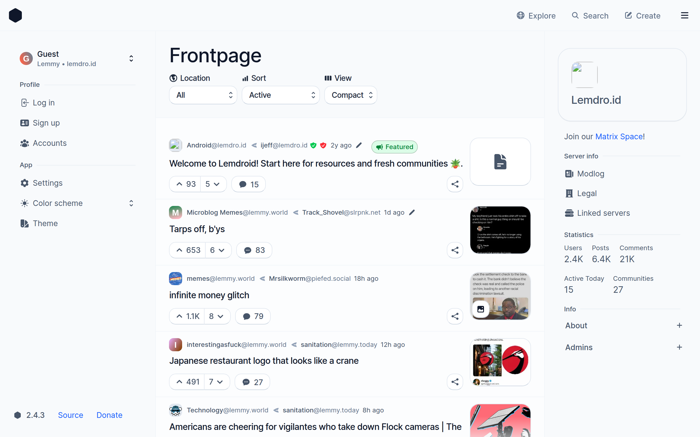
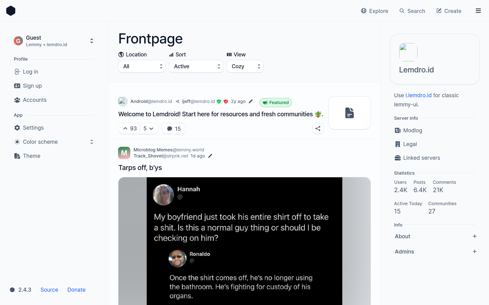
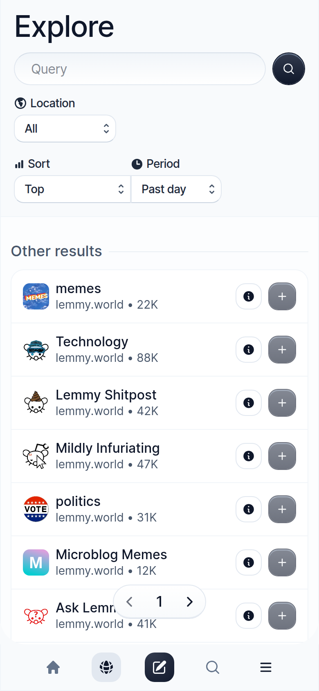

<picture>
    <source media="(prefers-color-scheme: dark)" srcset="screenshots/compact-dark.png">
    
</picture>

<details>
<summary>Screenshots</summary>

<picture>
    <source media="(prefers-color-scheme: dark)" srcset="screenshots/cozy-dark.png">
    
</picture>

<picture>
    <source media="(prefers-color-scheme: dark)" srcset="screenshots/mobile-dark.png">
    
</picture>

</details>

# Photon

> [!NOTE]
> This repository is a modified fork of [Xyphyn/photon](https://github.com/Xyphyn/photon), maintained by [duckesteles](https://github.com/duckesteles).
> It is not affiliated with or endorsed by the upstream project. Modifications made here are listed in [CHANGES.md](../CHANGES.md).
>
> Like the upstream project, this fork is licensed under AGPL-3.0-only. See [LICENSE](../LICENSE).

Photon is a web app for the fediverse with helpful features and a nice UX.

Jump to:

- [Self-hosting](#self-hosting)
- [Public Instances](#public-instances)

## Features

- Modern, intuitive and useful interface with thoughtful UX
- Multi-account switching
- Supports Lemmy & Piefed
- Infinite scroll
- Multiple languages thanks to [the community](https://weblate.xylight.dev)
- Customizable
- Supports almost all available Lemmy features
- Svelte-based, for responsiveness
- 2.8x smaller JavaScript payload compared to lemmy-ui
- Optimized image loading where possible to save bandwidth

## Self-hosting

You self-host a Photon frontend server for your Lemmy instance, or independently for any instance.

### Running from Docker image

The images are at `ghcr.io/xyphyn/photon`. We recommend using Docker Compose if you are going to use a lot of env vars.

> [!NOTE]
> If you encounter strange issues running the default images (using a Bun server), you can use the alternative Node server by appending `-node` to the image version.
> For example: `ghcr.io/xyphyn/photon:v2.0.0-node`

To run an unconfigured Photon instance on port `8080`:

```sh
docker run -p 8080:3000 ghcr.io/xyphyn/photon:latest
```

### Running natively

Clone the repo:

```sh
git clone https://github.com/xyphyn/photon && cd photon
```

Then to build and run:

##### Bun server (faster)

```sh
bun install
ADAPTER=bun bun run build

# run the built server
bun build/index.js
```

##### Node server (slower but better support)

```sh
npm install
ADAPTER=node npm run build

node build/index.js
```

### Configuration

Photon lets you configure the default client settings and more.

##### Common

> [!NOTE]
> Configuration environment variables are prefixed with PUBLIC to allow clients to use them. No sensitive data can be leaked.

If you're hosting Photon for a Lemmy instance, you'll almost definitely want to set these:

- `PUBLIC_INSTANCE_URL` `string` (default: `lemmy.zip`): The domain which **the browser** will send API requests to.
  - Example: `PUBLIC_INSTANCE_URL=fedi.phtn.app`

- `PUBLIC_INSTANCE_TYPE` `lemmyv3 | piefedalpha` (default: `lemmyv3`): If your instance is running PieFed, you must set this option to `piefedalpha`. Otherwise, you don't need to do anything.

- `PUBLIC_SSR_ENABLED` `boolean` (default: `false`): When enabled, will **make page requests be rendered server side first**, which allows search engine indexing, and basic non-js usage. On Cloudflare Pages this also decides how the app is built: left off, the build is fully static and serves no Functions requests; turned on, the Cloudflare adapter is used and every page request becomes a Functions invocation.

- `PUBLIC_LOCK_TO_INSTANCE` `boolean` (default: `false`): Restricts logging in and signing up to `PUBLIC_INSTANCE_URL`. Left off, users can reach any instance.

- `PUBLIC_COLORSCHEME` `system | light | dark` (default: `dark`): The color scheme new visitors get before they pick one themselves.

- `PUBLIC_INTERNAL_INSTANCE` `string`: Only relevant if `PUBLIC_SSR_ENABLED=true`. This is the domain that the **server will make API requests to.**

- `PUBLIC_SOURCE_URL` `string` (default: this repository): The URL the in-app "Source" links point to. If you modify Photon, set this to the repository holding **your** modified source. AGPL-3.0 section 13 requires network users to be offered the source of the version they are actually using, so do not point this at an unrelated repository.

- `PUBLIC_MIGRATE_COOKIE` `boolean`: Useful if moving from lemmy-ui. This will automatically migrate the logins for the users, making them not have to login again.

- `PUBLIC_THEME` `JSON`: If you'd like, you can export a theme from Photon and paste it here, which will become the default theme for users.

- `RECOMMENDED_INSTANCES` `string`: (Only suitable for unlocked Photon instances) a comma separated list of instance domains that will be displayed as "recommended" on the sign-up page.

##### Default Photon options

Photon has extensive user configuration options, and you can set the defaults for them with the environment variables found at `src/lib/settings.ts`, by looking at the `defaultSettings` object.

## Additional tips

> [!TIP]
> It's recommended to set up some script to pull the latest Docker image version or update some other way.
> Photon is constantly updated with fixes and improvements, and using heavily outdated versions can tarnish the reputation! So please keep it mostly up to date :)

> [!TIP]
> If you'd like to restrict users to `PUBLIC_INSTANCE_URL`, set the environment variable `PUBLIC_LOCK_TO_INSTANCE=true`.

> [!TIP]
> Photon supports nearly everything lemmy-ui does, so you can use it as a drop-in replacement as the primary frontend.
> However, the instance must have already been set up.

## FAQ

- **Q**: I'm getting errors about header buffer size in NGINX!
- **A**. You can apply the fix in [this comment](https://github.com/Xyphyn/photon/issues/253#issuecomment-1960734537). You can also try using the Node server instead of the Bun server (instructions above)

## Public Instances

Want your instance added here? Make a GitHub issue or make a PR. (this is for general purpose Photon instances.) If your instance stays out of date for a while, it will be removed.

[phtn.app](https://phtn.app) is the official instance and will get updates instantly.

| Instance                                    | Location   | Contact                                         |
| ------------------------------------------- | ---------- | ----------------------------------------------- |
| [phtn.app (Official)](https://phtn.app)     | 🇺🇸 US West | [photon@xylight.dev](mailto:photon@xylight.dev) |
| [ph.end.dedyn.io (Fork)](https://ph.end.dedyn.io) | 🌐 Global  | [duckesteles](https://github.com/duckesteles)   |

## Donate

I've put my best effort into developing and maintaining this open source app. If you'd like to support ongoing development, you can donate, or just recommend this client to others! [Buy me a Coffee](https://buymeacoffee.com/xylight)

<a href="https://www.buymeacoffee.com/xylight"></a>
